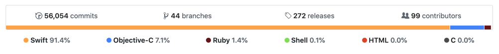

# Cookpad Summer Internship 2020 iOS

## 講義の目的

MiniCookpad アプリの開発を通し、クックパッドアプリのアーキテクチャと、簡単なソフトウェアテストを体験し理解してもらいます。

## 疑問質問

講義中に疑問が湧いた場合はSlackに書いておいていただければ講師もしくはTAが回答します。  
今回は画面越しで、困っていても気がつけないかもしれないので、初歩的な質問でも恥ずかしがらず積極的に聞いてください 🙋‍♂️

## 自己紹介

Kibela をみつつ自己紹介

## Cookpad の iOS アプリ

- 2009年リリース http://touchlab.jp/2009/11/cookpad-iphone/
- 複数の部署がコントリビュートするアプリ
  - 2020年初〜7月末で30人
- 多機能
  - レシピ閲覧、検索、レシピ投稿、つくれぽ投稿、入会、課金、お気に入り(クリップ)、アイデア、料理アルバム...
- コード行数約29万行, ファイル数約4000
- Swift 91.4%

## Cookpad のiOSアプリの取り組み

- [クックパッドアプリはみんなが寝ている間にサブミットされる](https://techlife.cookpad.com/entry/2018/09/14/090000)
  - 毎週金曜日の夜に自動でアプリが審査に出される仕組み
- [〜霞が関〜　クックパッドiOSアプリの破壊と創造、そして未来](https://techconf.cookpad.com/2019/kohki_miki.html)
  - コードの整理、ObjCの破壊、ビルド時間の改善 -> マルチモジュール化
- [大規模なiOSアプリの画面開発を効率化するために動作確認用ミニアプリを構築する](https://techlife.cookpad.com/entry/2020/08/05/090000)
  - モジュール単体でビルドすることで、ビルド時間を削減
- [iOSアプリのメモリリークを発見、改善する技術](https://techlife.cookpad.com/entry/2020/03/03/115000)
  - メモリリークの改善
- [良い感じにログを収集するライブラリ、Puree\-Swiftをリリースしました](https://techlife.cookpad.com/entry/2018/02/28/113000)
  - OSS に対する取り組み

## 講義内容

* 今日
  1. アーキテクチャについて
  3. Firebase について
  2. ハンズオンの説明
  3. ランチタイム 12:00~13:00 
  3. レシピ一覧画面をリファクタリング
  4. レシピ一覧画面のテストを書く
  3. レシピ詳細画面をリファクタリング
  5. 投稿機能を作ってみる(発展課題)
  4. 認証画面を作ってみる(発展課題)
  5. 終了 18:00
* 明日
  1. 認証画面を作ってみる(発展課題) 10:00~12:00
  2. 午後はサービス開発コース
