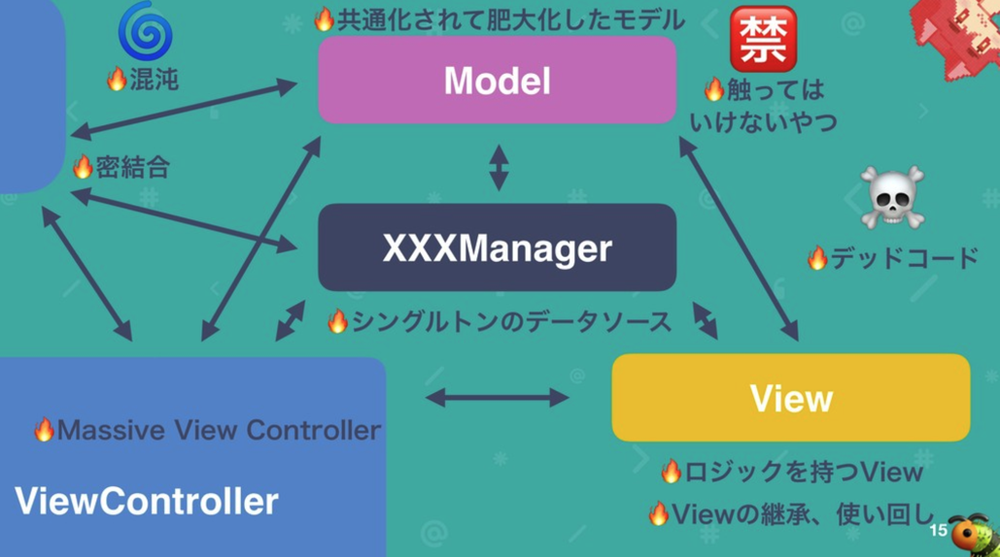
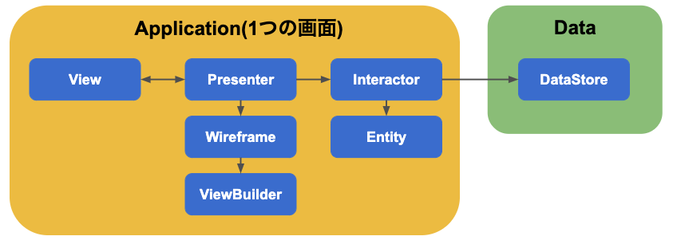
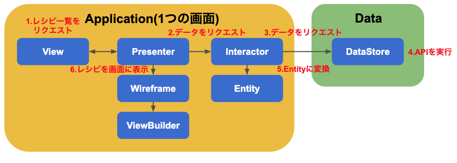

# アーキテクチャ(設計)について

モバイルアプリではここ数年、アーキテクチャに関する議論が盛んです。

なぜアプリ開発においてもアーキテクチャが重要になっているのか、クックパッドのiOSアプリではどのようなアーキテクチャを定めているのか解説していきます。

## アーキテクチャとは何か

ソフトウェアを書く際の設計思想のことです。
例えば、Apple は [MVC パターンに関するドキュメント](https://developer.apple.com/library/archive/documentation/General/Conceptual/DevPedia-CocoaCore/MVC.html)を公開しています。 (現在は Retired Document とあり、推奨されていないようです。)

ざっくりいうと
- Modelはアプリのデータ定義やロジックの記述しデータに変更があればControllerに通知
- Viewは画面の描画とユーザインタラクション
- Controllerはライフサイクルの管理とModel-Viewの橋渡し

というように責務を分担しています。

他にもUIのあるソフトウェアのアーキテクチャとして MVVM, Flux などがあります。
どのアーキテクチャが正解というものはなく、プロダクトのフェーズやメンバーの得意不得意など、状況に合わせて選択する必要があります。

## なぜアーキテクチャが必要なのか

- アーキテクチャが定まってないと...
  - 大規模になってくると...
    - 画面や機能の再利用ができなくなってくる
    - データの生合成が取れなくなってくる
  - 同じ振る舞いをするプログラムでも無限の実現方法が存在する
    - 他の人が書いたコードを素早く理解するのは難しい
    - 10人が各々の書き方でコードを書いたら...
- アーキテクチャが定まっていると
  - 開発者同士の共通理解ができる
    - レビューがしやすいし、他の人が書いたコードだとしても理解しやすい
  - 責務が明確になる
  - 再利用性が高まる

## アーキテクチャが定まる前のクックパッド

クックパッドでは、MVC アーキテクチャで実装されていました。

> https://speakerdeck.com/giginet/cookpad-techconf-2019-xia-gaguan-kutukupatudoiosapurifalse-po-huai-tochuang-zao-sositewei-lai

## クックパッドのアーキテクチャ

VIPER アーキテクチャを参考にアレンジしたものを使っています。
View, Interactor, Presenter, Entity, Router の頭文字を取って VIPER と呼ばれています。

VIPER では Contract (契約) という protocol を定義したファイルを作成します。それぞれの要素は protocol を通した依存になります。

> 出典: https://cheesecakelabs.com/blog/ios-project-architecture-using-viper/

- View
    - UIの表示、イベントをPresenterに伝える。iOSの場合はUIViewController
- Interactor
    - データの取得や計算などの計算などのロジック。Entity を扱って良いのは Interactor のみ
- Presenter
    - View からイベントを受け、Interactor に処理を依頼したり、Router に画面遷移の依頼をする
- Entity
    - 単純な struct。Interactor しか扱わない。
- Router
    - 画面遷移と、依存関係の解決

クックパッドでは Router を Wireframe と ViewBuilder に分離し、Interactor から先をさらに細かくし DataStore を用意しています。

最終的にはこのような図になります。

- アプリケーションレイヤー
  - View
    - UIの表示、イベントをPresenterに伝える。iOSの場合はUIViewController
  - Interactor
    - DataStore に処理を依頼し、取得したデータをEntityに変換する。また、画面固有のロジックを記述する
  - Presenter
    - View からイベントを受け、Interactor に処理を依頼したり、Wireframe に画面遷移の依頼をする
  - Entity
    - 単純なデータの struct。VIPER とは違い View や Presenter も Entity を扱って良い
  - ViewBuilder(VIPERでいうRouter)
    - それぞれのインスタンスを作り、依存関係を解決する。UIViewControllerの生成はViewBuilder経由となる
  - Wireframe(VIPERでいうRouter)
    - 画面遷移
  - Contract
    - アプリケーションレイヤーのインターフェース(protocol)をまとめたもの
- データレイヤー
  - DataStore
    - APIやUserDefaultsなどの外部データの取得、更新を行う。複数画面から共有される

## レシピ一覧画面の流れ

