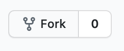
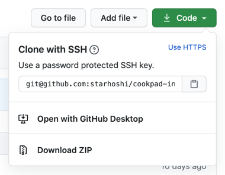

# ハンズオン

ドキュメントに沿ってアプリをリファクタリング/開発してもらいます。  
質問のある方, うまくいかなくて詰まってしまった方などは遠慮なく Slack に書いてください。

後半の日程で PBL がありますが、その際はこのアーキテクチャで実装する必要はないです。

## リポジトリをFork

事前準備では直接 clone をお願いしていましたが、以下のリポジトリを Fork してください。  

https://github.com/cookpad/cookpad-internship-2020-summer-ios



作業中の質問に回答する際など、出来ているところまで push してもらう可能性があります。  
また、2日目のiOS講義が終わったタイミングで出来ているところまで push をお願いします。

Fork が完了したら、事前セットアップしてもらった git の origin を Fork したものに変更します。HTTPSではなく **SSH** になっていることを確認してください。




```shell
$ cd cookpad-internship-2020-summer-ios
$ git remote set-url origin コピーしたssh
```

以下のコマンドで git の origin を変更できたか確認できます。  
出力結果が先ほどコピーしたものと一致するか確認してください。

```shell
$ git config --get remote.origin.url
```

## リポジトリを最新に更新

まず、 `git status` を実行して変更中のファイルがないか確認してください。

```shell
$ git status
On branch master
Your branch is up to date with 'origin/master'.

nothing to commit, working tree clean
```

もし何か変更がある場合、その変更を取り消しても良い場合は以下を実行ください。

```shell
$ git checkout .
```

変更を残しておきたい場合は `git stash -u` や、別途branchを切ってコミットしておいてください。  
リポジトリ更新にあたって conflict してしまうと大変なので、初期の状態に戻してください。

git がきれいになったら、以下のコマンドでリポジトリを更新してください。

```shell
$ git fetch origin
$ git merge origin/master
```

## MiniCookpad

### 有する機能

- レシピ一覧
- レシピ詳細
- レシピ投稿
- 認証

### 初期データ構築

アプリを起動すると、画面左上に「データ追加」というボタンが表示されます。
このボタンをタップすると、「アスパラの肉巻き」のレシピデータが追加されます。
初回起動時はこのボタンを押し、レシピを表示してください。


## 注意点

GoogleService-Info.plist を GitHub などにアップロードしてしまうと悪用される可能性があります。
MiniCookpad では .gitignore していますが、 public なレポジトリに公開する際は注意してください。
